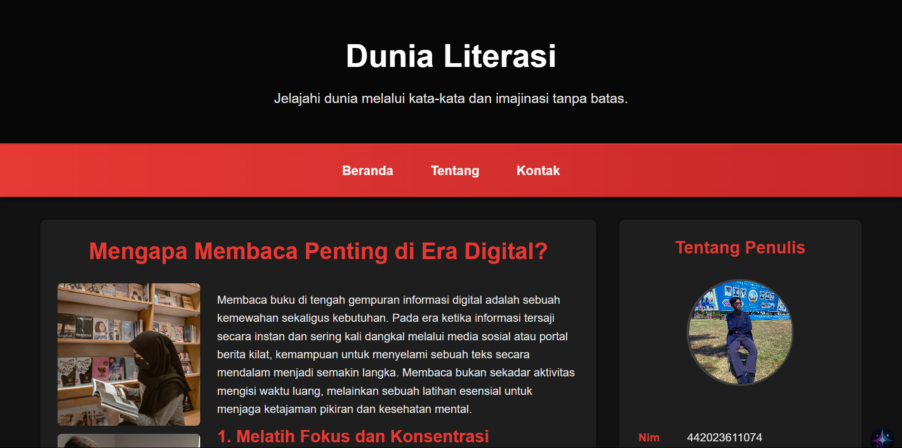

# Dunia Literasi - Landing Page

Ini adalah repositori untuk "Dunia Literasi," sebuah proyek landing page yang responsif dengan tema gelap. Halaman ini dibuat menggunakan HTML, CSS, dan JavaScript vanilla, serta menampilkan konten tentang pentingnya membaca di era digital dan tips membaca yang efektif.

## 📸 Tampilan Proyek

 

## ✨ Fitur Utama

- **Desain Responsif**: Tampilan situs web dapat beradaptasi dengan baik di berbagai ukuran layar, mulai dari desktop hingga perangkat mobile.
- **Navigasi Menempel (Sticky Navigation)**: Menu navigasi akan tetap terlihat di bagian atas layar saat pengguna menggulir halaman ke bawah, memberikan akses yang mudah ke bagian lain.
- **Animasi Saat Scroll**: Kartu konten (artikel) muncul dengan efek *fade-in* dan *slide-up* saat masuk ke dalam area pandang pengguna, diimplementasikan menggunakan `IntersectionObserver` API untuk performa yang optimal.
- **Tema Gelap (Dark Mode)**: Menggunakan skema warna gelap yang nyaman di mata dengan aksen merah yang modern.
- **Struktur Semantik**: Dibangun dengan HTML5 semantik untuk meningkatkan aksesibilitas dan SEO.
- **Efek Interaktif**: Efek *hover* yang halus pada tautan navigasi, kartu, dan tombol untuk pengalaman pengguna yang lebih dinamis.

## 💻 Teknologi yang Digunakan

- **HTML5**: Untuk struktur dasar dan konten halaman web.
- **CSS3**: Untuk styling, layouting (Flexbox), variabel CSS, dan animasi.
- **JavaScript (ES6+)**: Untuk fungsionalitas interaktif seperti navigasi menempel dan animasi saat scroll.

## 📁 Struktur File

```
dunia-literasi/
├── assets/
│   └── images/
│       ├── ... (berbagai file gambar)
├── styles/
│   └── style.css
├── scripts/
│   └── script.js
└── index.html
```

## 🚀 Cara Menjalankan Proyek

1.  **Clone repositori ini:**
    ```bash
    git clone https://github.com/Mystery-World3/dunia-literasi-landing-page.git
    ```

2.  **Masuk ke direktori proyek:**
    ```bash
    cd dunia-literasi-landing-page
    ```

3.  **Buka file `index.html`** di browser pilihan Anda (misalnya, dengan klik dua kali pada file tersebut).

## 👤 Tentang Penulis

Profil penulis dapat ditemukan di dalam sidebar halaman web.

- **Nama**: Muhammad Mishbahul Muflihin
- **NIM**: 442023611074
- **Domisili**: Jombang, Jawa Timur
- **Email**: mishbahulmuflihin@gmail.com
- **Telepon**: 0856-4880-4502

---
&copy; 2025 Dunia Literasi. Tautan ke repositori GitHub proyek ini tersedia di bagian footer.
